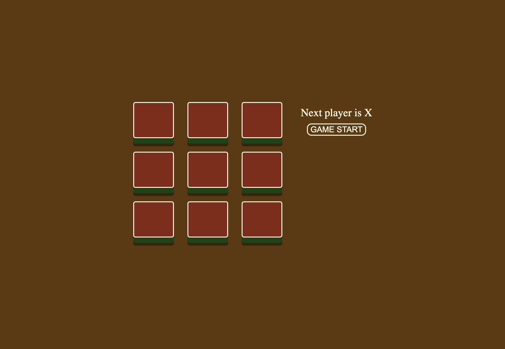
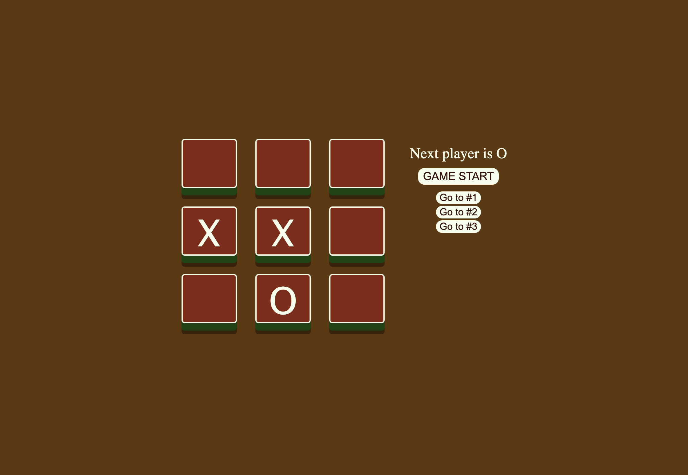
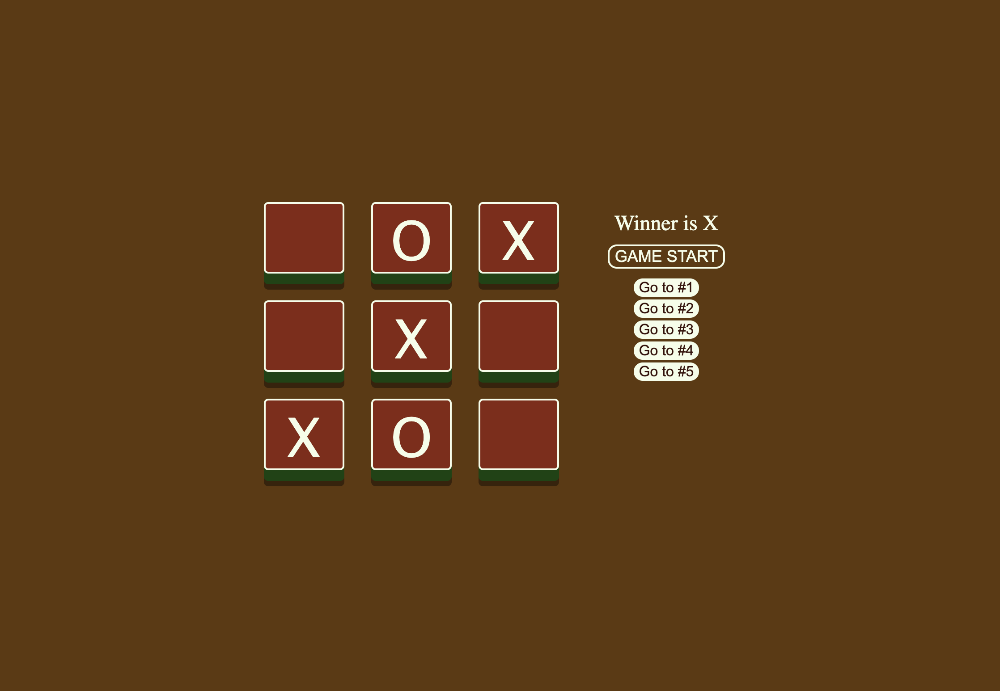

# Tic-Tac-Toe

tic-tac-toe game with react

deploy: https://ssj24.github.io/tic-tac-toe/

reference: https://github.com/basir/react-tic-tac-toe

- create game UI
- useReducer
- move history
- calculate winner

This is an initial state of the game.

The statement at the upper right tells you who's turn is it.

You can start the new game anytime you want.

Just click the GAME START button.

After game over(whether there is winner or not), buttons are disabled.

Still you could get back to the specific move with the buttons on the right.